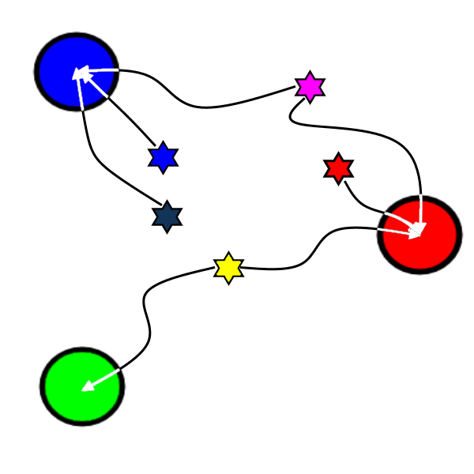

.. _mapping-primer:

Mapping primer
==============
Mapping is performed by the :class:`~id_translation.mapping.Mapper` class. The general procedure is the same for
the :ref:`Name-to-source <Name-to-source mapping>` and :ref:`Placeholder <Placeholder mapping>` mapping processes.

.. seealso::
   If you haven't already, consider checking out the :ref:`translation-primer` before continuing.

There are two principal steps involved in the mapping procedure: The :ref:`Step 1/2: Scoring procedure`
(:attr:`~.Mapper.compute_scores`) and the subsequent :ref:`Step 2/2: Matching procedure`
(:attr:`~.Mapper.to_directional_mapping`). The :class:`.Translator` and :class:`.AbstractFetcher` classes use
:meth:`.Mapper.apply`, which combines these two methods.

Step 1/2: Scoring procedure
---------------------------
The ``Mapper`` first applies :ref:`Overrides and filtering`, after which the actual :ref:`Score computations` are
performed.

.. |caption| raw:: html

  
Colours mapped by   spectral distance (RGB).

   |caption|

Overrides and filtering
~~~~~~~~~~~~~~~~~~~~~~~
Overrides and filtering adhere to a strict hierarchy (the one presented below). Overrides take precedence over filters,
and runtime overrides takes precedence over static overrides.

1. Runtime overrides (type: :attr:`~id_translation.mapping.types.UserOverrideFunction`); set ``score=∞`` for the chosen
   candidate, and ``score=-∞`` for others.

2. Static overrides (type: ``dict`` or :class:`~rics.collections.dicts.InheritedKeysDict`); set ``score=∞`` for the
   chosen candidate, and ``score=-∞`` for others.

3. Filtering (type: :attr:`~id_translation.mapping.types.FilterFunction`); set ``score=-∞`` for undesirable matches only.

.. hint::
   Score-based mapping trades precision for convenience. This may be undesirable, especially for fetching as this may
   incur additional costs. See the :ref:`Override-only mapping` section for details.

Score computations
~~~~~~~~~~~~~~~~~~
4. Compute value-candidate match scores (type: :attr:`~id_translation.mapping.types.ScoreFunction`). Higher is better.

5. If there are any Heuristics (type: :class:`~id_translation.mapping._heuristic_score.HeuristicScore`), apply..

    a. Short-circuiting (type: :attr:`~id_translation.mapping.types.FilterFunction`); reinterpret a ``FilterFunction``
       such that the returned candidates (if any) are treated as overrides.

    b. Aliasing (type: :attr:`~id_translation.mapping.types.AliasFunction`); try to improve ``ScoreFunction`` accuracy
       by applying heuristics to the ``(value, candidates)``-argument pairs.

    c. Finally, select the best score at each stage (from no to all heuristics) for each pair.

The final output is a :class:`.ScoreMatrix`, which has been :meth:`converted <.ScoreMatrix.to_pandas>` to an equivalent
:class:`~pandas.DataFrame` below.

.. csv-table:: Partial mapping scores for the :ref:`dvdrental` example.
   :file: dvdrental-scores.csv
   :header-rows: 1
   :stub-columns: 1

The ``'rental_date'``-value can be seen having only negative-infinity matching scores due to filtering.

.. hint::

   The :meth:`Translator.map_scores <id_translation.Translator.map_scores>`-method returns Name-to-source mapping scores.

Step 2/2: Matching procedure
----------------------------
Given precomputed match scores (see the section above), make as many matches as possible given a ``Cardinality``
restriction. These may be summarized as:

* :attr:`~id_translation.mapping.Cardinality.OneToOne` = *'1:1'*: Each value and candidate may be used at most once.
* :attr:`~id_translation.mapping.Cardinality.OneToMany` = *'1:N'*: Values have exclusive ownership of matched candidate(s).
* :attr:`~id_translation.mapping.Cardinality.ManyToOne` = *'N:1'*: Ensure that as many values as possible are
  *unambiguously* mapped (i.e. to a single candidate). This is the **default** for new :class:`.Mapper` instances.
* :attr:`~id_translation.mapping.Cardinality.ManyToMany` = *'M:N'*: All matches above the score limit are kept.

In theory, ``OneToMany`` and ``ManyToOne`` are equally restrictive. During mapping however, *the goal is usually to
find matches for values, not candidates*. With that in mind, the ordering above may be considered strictly decreasing
in preciseness.

Conflict resolution
~~~~~~~~~~~~~~~~~~~
When a single match out of multiple viable options must be chosen due to cardinality restrictions, priority is
determined by the iteration order of `values` and `candidates`. The first value will prefer the first candidate, and so
on. This logic does `not` consider future matches.

>>> mapper = Mapper(cardinality='1:1', score_function=lambda value, *_: [1, 0] if value == 'v1' else [1, 1])
>>> mapper.compute_scores(['v0', 'v1'], ['c0', 'c1'])
candidates   c0   c1
values
v0          1.0  1.0
v1          0.0  1.0
>>> mapper.apply(['v0', 'v1'], ['c0', 'c1']).flatten()
{'val0': 'cand0'}

Note that `val1` was left without a match, even though it could've been assigned to `cand0` if the equally viable
matching `val0 → cand1` had been chosen first.

.. note::
   A score matrix like this will raise :class:`.AmbiguousScoreError` for any cardinality that requires a single
   candidate (including `1:1`).

Troubleshooting
---------------
Unmapped values are allowed by default. If mapping failure is not an acceptable outcome for your application, initialize
the ``Mapper`` with ``on_unmapped='raise'`` to ensure that an error is raised for unmapped values, along with
more detailed log messages which are emitted on the error level.

Verbose logging
~~~~~~~~~~~~~~~
The mapper can emit per-combination mapping scores when matches are made or when values are left without a match. These
messages are gated behind :data:`~id_translation.logging.ENABLE_VERBOSE_LOGGING`.

The messages below are from a test case in a strange world where only one kind of animal (`cardinality=1:1`) is allowed
to have a specific number of legs.

.. code-block:: log
    :caption: A listing of matches that were rejected in favour of the current match.

    id_translation.mapping.Mapper: Accepted: 'dog' -> '4'; score=inf (short-circuit or
      override). This match supersedes 1 other matches:
        'cat' -> '4'; score=1.000 (superseded on candidate=4).

In the case above, `dog` was selected over `cat` to because it was given first in the `values` vector. Matches that
would not have been made regardless (e.g. score below `min_score` are not shown in the `accept`-message.

.. code-block:: log
   :caption: Explanation of why a match was not made.

   id_translation.mapping.Mapper: Could not map value='cat'. Rejected matches:
        'cat' -> '4'; score=1.000 (superseded on candidate=4: 'dog' -> '4'; score=inf).
        'cat' -> '0'; score=0.000 < 0.9 (below threshold).
        'cat' -> '2'; score=0.000 < 0.9 (below threshold).
        'cat' -> '3'; score=0.000 < 0.9 (below threshold).

The severity of unmapped values is determined by the :attr:`.Mapper.on_unmapped` attribute. The
:data:`~id_translation.logging.ENABLE_VERBOSE_LOGGING` flag also enables detailed output from a other loggers in the
`mapping` namespace.

.. code-block:: log
   :caption: Messages from the scoring procedure.

   id_translation.mapping.HeuristicScore: Heuristics scores for value='name': [
     'last_update': 0.06 -> 0.10 (+0.03), 'first_name': 0.14 -> 0.99 (+0.85),
     'email': 0.12 -> 0.12 (+0.00), 'address_id': -0.00 -> -0.00 (+0.00),
     'create_date': 0.06 -> 0.14 (+0.08), 'last_name': 0.16 -> 0.38 (+0.22),
     'store_id': -0.01 -> -0.01 (+0.00), 'active': 0.08 -> 0.08 (+0.00),
     'customer_id': -0.01 -> -0.01 (+0.00)]
   id_translation.mapping.filter_functions.filter_names: Refuse matching for
     name='return_date': Does not match pattern=re.compile('.*_id$', re.IGNORECASE).

The mapping procedure may emit a large amount of records in verbose mode.

.. _override-only-mapping:

Override-only mapping
---------------------
Score-based mapping is a convenient solution, especially for name-to-source mapping since the names (e.g.
:attr:`pandas.DataFrame.columns`) that should be translated have a tendency to change.

.. note::

   Identity mappings always kept (no need for ``id = "id"`` overrides). To block these matches, you may create a dummy
   override such as ``id = "_"`` for affected sources.

Names in sources (e.g. SQL table column names), on the other hand, tend to change a lot less. Scoring may then add an
unnecessary element of uncertainty. To ensure that mapping is done "manually", you may use the included
:func:`.score_functions.disabled`-function to disable the scoring logic.

.. literalinclude:: override-only-fetching.toml
   :language: toml
   :caption: A conservative override-only mapping configuration for an ``SqlFetcher``.
   :linenos:

In strict mode (the default), a :class:`~id_translation.mapping.exceptions.ScoringDisabledError` is raised if there are
any names left to map once all :ref:`overrides and filtering` and :ref:`short-circuiting <Score computations>` logic
has been applied.

.. seealso::

  * The :func:`~.heuristic_functions.short_circuit` and :func:`~.heuristic_functions.smurf_columns` short-circuiting functions.
  * The :mod:`.filter_functions` module.

In non-strict mode (``strict=False``), any name left to map once the scoring phase begins will be
**silently discarded** by returning :math:`-\infty` for all value/candidate-pairs.
